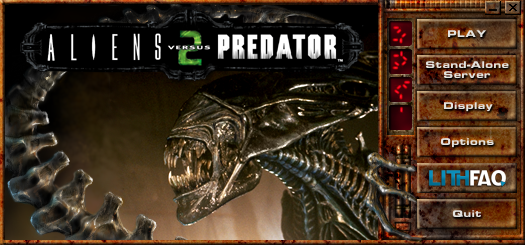

# Aliens vs. Predator 2 Launcher

This is a recreation of the official AVP2 Launcher written in C with the [raylib](https://www.raylib.com/) library.

## Features

* Can setup the registry to "install" AVP2. Very useful for copying the directory and not wanting to install it.
* More to come...

## TODO
* Play button does not work
* Server button does not work
* Display button does not work

## Installation

Download a release and save it in your Aliens vs. Predator 2 installation folder and the .exe

## Compiling

Simply download the git repository and run cmake with Ninja.

* Tested compilers
    * GCC
    * MSVC 2022
